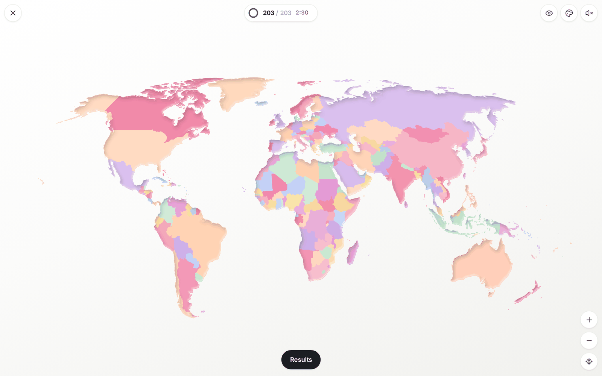
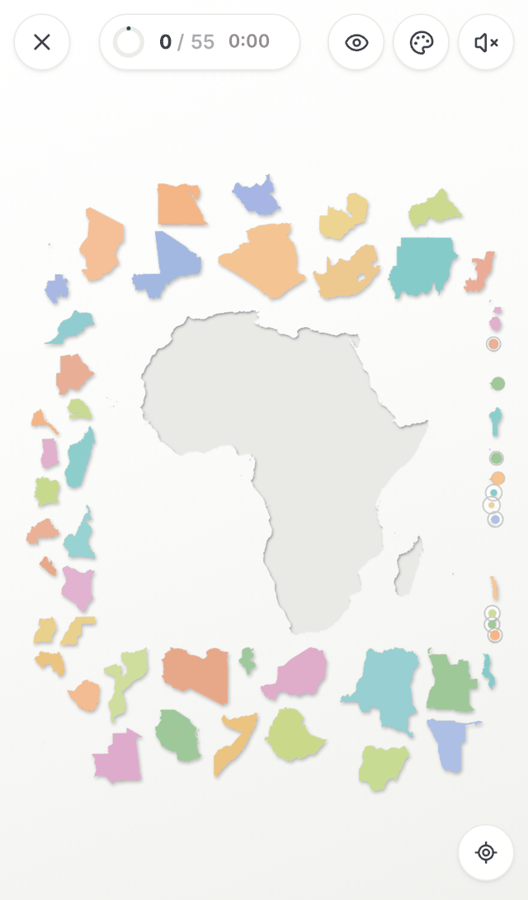
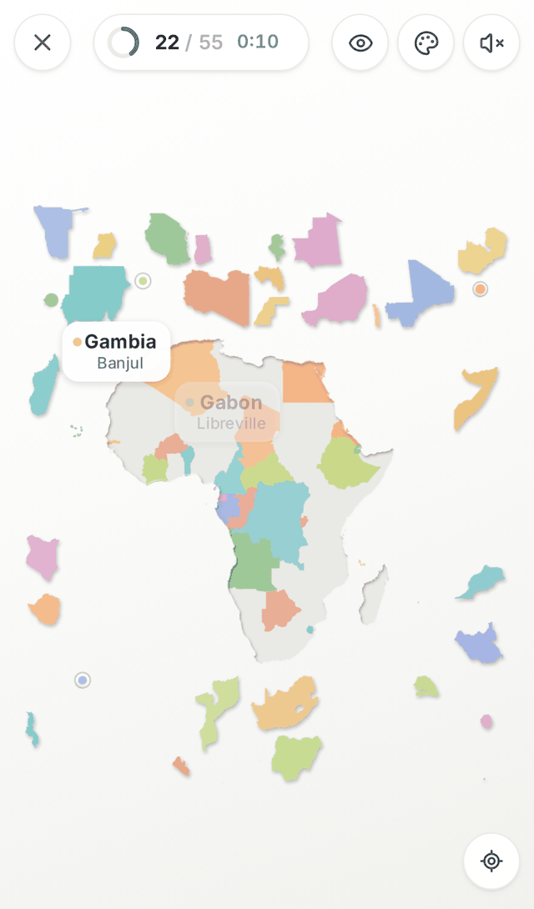
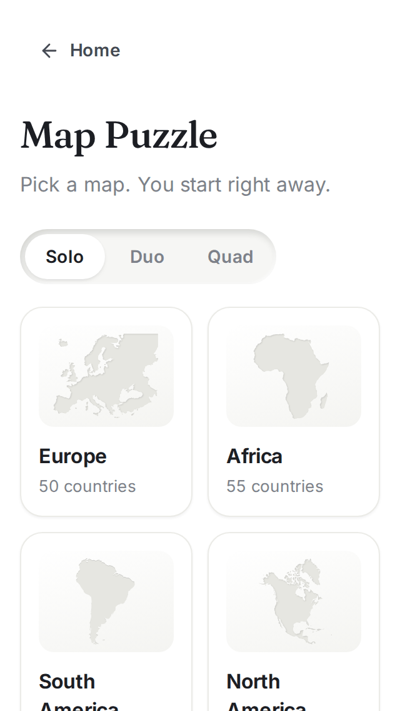
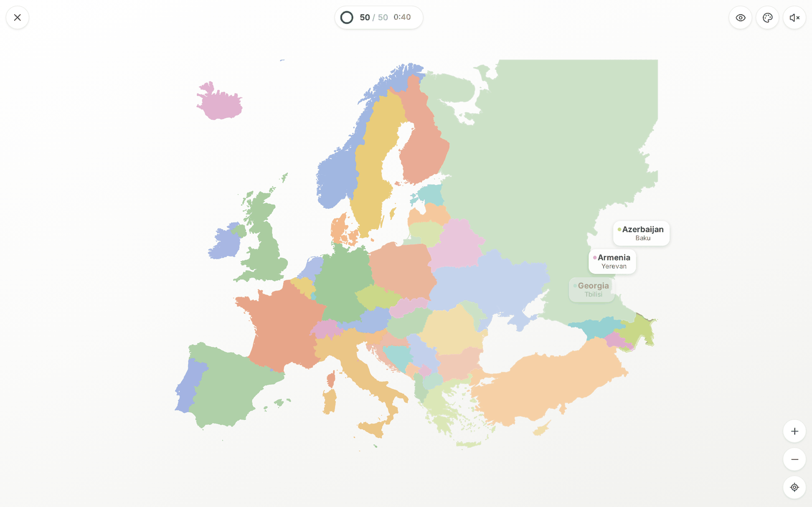
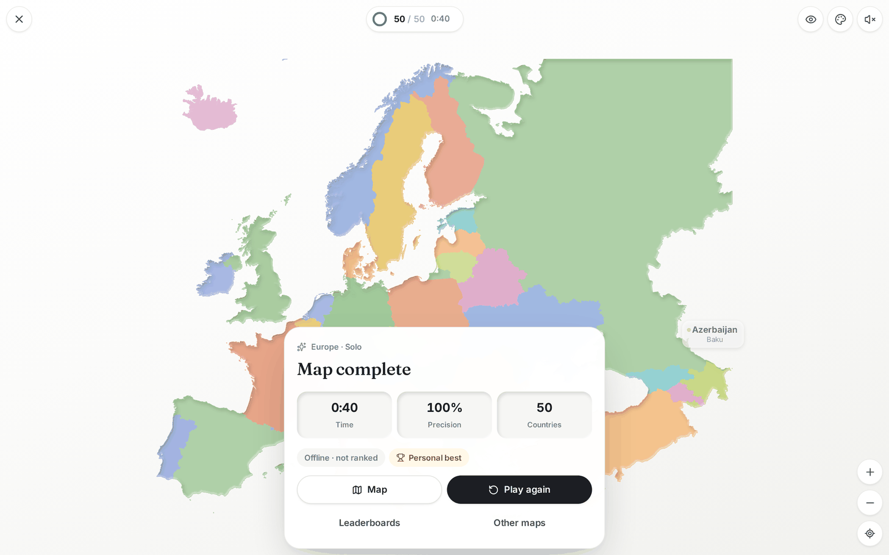

# GeoLearn

Calm geography games you can play alone or with friends. You don't need an account, just a name.

The first game is **Map Puzzle**. You get an empty continent and every country is a loose piece lying around it. You drag the pieces into place until the map is whole. Everyone in the room sees every piece move in real time. Whoever is holding a piece controls it, and everyone else can grab any other piece.

<p align="center">
  
</p>

<p align="center">
  
  &nbsp;
  
  &nbsp;
  
</p>

<p align="center">
  
  
</p>

## Features

- **Seven maps.** Europe (50 pieces), Africa (55), Asia (50), North America (25), South America (14), Oceania (15) and The World (203).
- **Every map starts as a blank continent.** Nothing on the empty board shows where the borders are. When all the pieces are in, you get a borderless map with a flat colour for each country.
- **Party sizes: Solo, Duo and Quad.** Modes:
  - **Together** (co-op): everyone works on the same map against the clock.
  - **Versus**: everyone plays for themselves, and each placed country scores points.
  - **Teams** (Quad only): 2 vs 2.
- **Real-time multiplayer.** You see other players' pieces move, with a name tag in their colour. A piece is locked while someone is holding it. If the host leaves, another player becomes host. If you drop off, you reconnect to the same seat.
- **Built for phones first**, including the 320 px wide iPhone SE. Hold a piece with one finger and use other fingers to pan and pinch-zoom while you carry it.
- **Feels like a real table.** Pieces lift with a soft shadow, click into place with a small ripple, and a wave of light rolls across the map when it's finished. The sounds are generated with Web Audio, so there are no sample files.
- **First-game tips.** New players get one short line at a time, once per device: drag to place, pinch while holding, and press and hold to lift a piece off the board.
- **Visibility menu.** You can show names, capitals and flags on the pieces. All three are off by default. When a country clicks into place, its name and capital are revealed.
- **Eight palettes:** Atlas, Blossom, Ocean, Meadow, Sunset, Vintage, Candy and Stone.
- **Leaderboards** per map and party size, for all time or this week (see [Scoring](#modes-scoring--leaderboards)).
- **Solo works without a connection.** If the server can't be reached, solo games run in the browser with the same rules. These games are not ranked.

## Controls

|                                        | Touch                                                                       | Mouse / trackpad                                                           |
| -------------------------------------- | --------------------------------------------------------------------------- | -------------------------------------------------------------------------- |
| Pick up a loose piece                  | Press and drag. On touch screens, small pieces rise just above your finger. | Press and drag                                                             |
| Pan / zoom while holding a piece       | Use a second (and third) finger                                             | Scroll wheel zooms. On a trackpad, two-finger scroll pans and pinch zooms. |
| Move a piece that's lying on the board | Quick drag slides it                                                        | Quick drag slides it                                                       |
| Lift a piece off the board             | Press and hold (~0.3 s), then drag                                          | Press and hold, then drag                                                  |
| Pan / zoom the table                   | Drag an empty spot / pinch. Double-tap zooms in.                            | Drag an empty spot / scroll wheel / trackpad                               |
| What's this country?                   | Tap a placed piece                                                          | Click a placed piece                                                       |

Keyboard shortcuts: `+` / `-` zoom, `0` fits the whole table, arrow keys pan, and `Esc` cancels a drag.

## Modes, scoring & leaderboards

- A drop **counts** when the piece lands on land, whether that's its correct place or somewhere wrong on the continent. Drops onto the open table are free.
- **Precision** = correct placements ÷ drops that counted.
- **Versus points**: each correct placement scores 100, plus up to 50 for small (hard-to-find) countries, plus 10 for every clean placement in your current streak (max +50). A miss resets the streak.
- **Teams**: each team's score is the total of its players' points.

There are four leaderboards. Every board except All-time is split by map and by party size (solo, duo or quad). You can view each one for all time or for this week.

| Board     | What's ranked                                                                         |
| --------- | ------------------------------------------------------------------------------------- |
| Fastest   | Best completion time in Together mode. Each group of players keeps only its best run. |
| Precision | Best precision. Ties go to the faster run.                                            |
| Versus    | Each player's highest single-game score in Versus and Teams (Duo and Quad).           |
| All-time  | Most countries placed, across every map and mode.                                     |

**Names.** Names are first come, first served, from 2 to 20 characters. There are no passwords. A random token saved in your browser proves the name is yours, and the server only stores a hash of it. If you clear your browser storage, you give the name up.

## Quick start

Requirements: **Node 22+** and npm.

```bash
npm install
npm run dev
```

Then open <http://localhost:5173>. To test on your phone, connect it to the same Wi-Fi and open `http://<your-computer's-ip>:5173`.

`npm run dev` starts two things:

- the game server on `:8787`, with an embedded database (PGlite) stored in `.data/pglite`, so no setup is needed;
- the Vite dev server on `:5173`, which forwards `/api`, `/data` and `/ws` to the game server.

### Production build

```bash
npm run build   # builds the web app, then bundles the server with it
npm start       # web app + API + WebSocket on http://localhost:8787
```

The build is self-contained in `apps/server/dist`. It includes the web app, the puzzle data (pre-compressed with brotli and gzip) and the SQL migrations. Migrations run automatically when the server starts.

## Deploy

GeoLearn is one Node process that serves the website, the REST API and the WebSocket. For persistence it needs Postgres, or it falls back to the embedded PGlite.

> **Run exactly one instance.** Live rooms are kept in memory on the server that created them. `railway.json` already pins `numReplicas: 1`. One small instance handles a lot of rooms, because each room only relays a few messages per second per player.

### Railway (recommended)

1. **New Project → Deploy from GitHub repo**, and pick this repository. `railway.json` tells Railway to build the `Dockerfile` and health-check `/api/health`.
2. **+ New → Database → PostgreSQL.**
3. In the GeoLearn service, open **Variables** and add `DATABASE_URL` = `${{Postgres.DATABASE_URL}}`.
4. Go to **Settings → Networking → Generate Domain.** You don't need to set a port, because Railway provides `PORT` and the server listens on it.

If you skip Postgres, the app still runs on PGlite, but the data is wiped on every redeploy. You can keep it by attaching a Railway volume and setting `DATA_DIR` to the volume's mount path, for example `/data/pglite`.

### Supabase (as the database)

Supabase can be the database while the app runs on Railway or your own server. In Supabase, go to **Connect → Session pooler**, copy the connection string, and set:

```bash
DATABASE_URL=postgresql://postgres.<project>:<password>@aws-0-<region>.pooler.supabase.com:5432/postgres
DATABASE_SSL=true
```

The tables (`players`, `games`, `game_players`) are created automatically on first start.

### Your own server (Docker)

```bash
POSTGRES_PASSWORD=change-me docker compose up -d   # app + Postgres 17
# → http://localhost:8787
```

To use HTTPS, put a reverse proxy in front. It needs to pass WebSockets through, which Caddy does by default:

```
geolearn.example.com {
  reverse_proxy localhost:8787
}
```

With nginx, the `/ws` location needs `proxy_http_version 1.1;`, `proxy_set_header Upgrade $http_upgrade;` and `proxy_set_header Connection "upgrade";`.

You can also run `docker build -t geolearn . && docker run -p 8787:8787 -e DATABASE_URL=… geolearn` directly. If Docker Hub rate-limits you, pass `--build-arg NODE_IMAGE=mirror.gcr.io/library/node:22-bookworm-slim`.

### Configuration

Every setting is optional. See `.env.example`.

| Variable             | Default            | Purpose                                                                                                  |
| -------------------- | ------------------ | -------------------------------------------------------------------------------------------------------- |
| `DATABASE_URL`       | –                  | Postgres connection string. If it isn't set, embedded PGlite is used.                                    |
| `DATABASE_SSL`       | `false`            | Set to `true` for hosted Postgres that requires TLS, such as Supabase.                                   |
| `DATA_DIR`           | `.data/pglite`     | Where PGlite keeps its files.                                                                            |
| `PORT` / `HOST`      | `8787` / `0.0.0.0` | Where the server listens.                                                                                |
| `TRUST_PROXY`        | `true`             | Trust `X-Forwarded-*` headers from Railway, nginx or Caddy.                                              |
| `LOG_LEVEL`          | `info`             | Pino log level.                                                                                          |
| `MAX_SOCKETS_PER_IP` | `80`               | Simultaneous game connections from one IP address. It is generous, because a classroom can share one IP. |

## Map data

The country shapes are generated from **Natural Earth 1:10m Admin 0** (public domain). The goal is maps that are **current and neutral**. The full policy is in [`packages/shared/src/geo/countries.ts`](packages/shared/src/geo/countries.ts):

- **Countries included:**
  - all 193 UN member states;
  - the two UN observer states (Vatican City and Palestine);
  - Kosovo, Taiwan and Western Sahara;
  - five territories that the continent outlines need: Greenland, Puerto Rico, French Guiana, the Falkland Islands and New Caledonia.
- **Borders** follow the internationally recognised (UN) view:
  - Crimea is part of Ukraine;
  - the Golan Heights are part of Syria;
  - Northern Cyprus is part of Cyprus;
  - Somaliland is part of Somalia;
  - Western Sahara is shown whole.
- **Names** use current English short forms, such as Czechia, Türkiye, Eswatini, North Macedonia, Cabo Verde and Timor-Leste. Capitals are included, and flags come from [`flag-icons`](https://github.com/lipis/flag-icons).
- **Projections:** each continent uses an equal-area or conformal projection suited to it (Europe uses the EU's LAEA). The world map uses Natural Earth. All pieces keep their true orientation, so there's no rotating.

To regenerate the data (you need Python 3 with `shapely` installed):

```bash
npm run fetch -w @geolearn/geo          # download Natural Earth into packages/geo/cache
npm run prepare-data -w @geolearn/geo   # apply the border policy → cache/entities.geojson
npm run geo:build                       # project, simplify, colour → packages/shared/data
npm run preview -w @geolearn/geo        # PNG previews in packages/geo/previews
```

The build step does the following:

- **Topology-aware simplification.** Neighbouring countries keep an identical shared border, and coordinates are snapped to a 0.01 grid, so the finished map has no gaps or hairlines.
- **Three levels of detail.** The finest level is loaded only when you zoom in.
- **Colouring.** Neighbouring countries never share a colour.

## Architecture

```
apps/web         React 19 + Vite. The puzzle itself is a Canvas 2D engine in src/game/engine
apps/server      Fastify 5 + WebSocket rooms, REST API, Drizzle ORM (Postgres or PGlite)
packages/shared  Game rules and engine, protocol types, country list, puzzle data
packages/geo     Map pipeline: Natural Earth → projected, simplified, coloured pieces
e2e              Playwright tests (iPhone SE and desktop, including a two-player game)
```

- **The server has the final say.** The shared `GameEngine` runs on the server. It lays the pieces out around the board to suit the players' screen shapes, hands out piece locks, validates drops and keeps score.
  - Clients predict locally, so a grab or a snap feels instant. They correct themselves if the server disagrees.
  - Piece movements stream at about 30 Hz.
  - The same engine runs in the browser for offline solo play.
- **Empty board.** The empty board is every piece drawn as one filled shape with the nonzero fill rule, plus a soft inner shadow from a single light direction. Because shared borders are identical, no internal line can show at any zoom level.
- **Rendering.**
  - Pieces that aren't moving are drawn once into a cached layer. During pans and pinches that layer is moved with GPU transforms.
  - Only pieces that are moving are redrawn each frame.
  - Drop shadows come from pre-blurred sprites.
- **Networking.**
  - The client reconnects automatically with exponential backoff and keeps your seat with a session token.
  - It also syncs its clock with the server for countdowns.
  - Messages are validated with zod and rate-limited per connection.

## Development

```bash
npm run typecheck     # all packages
npm test              # unit + integration tests (Vitest), including a real WebSocket server
npm run build && npm run test:e2e   # Playwright: iPhone SE + desktop, solo and multiplayer
npm run format        # Prettier
```

CI runs the typecheck, the tests, the build and the end-to-end tests on every push to `main` and on every pull request (`.github/workflows/ci.yml`).

## Known limitations

- **One server instance.** Rooms live in memory, so a restart ends the games in progress. The results of finished games are already saved. Running more than one instance would need routing by room code.
- **No account recovery.** A name is tied to the browser that claimed it.
- **Placeholder games.** Capital Quest, Flag Match and Borderlines on the home page are marked "Soon".
